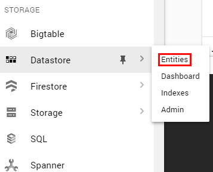
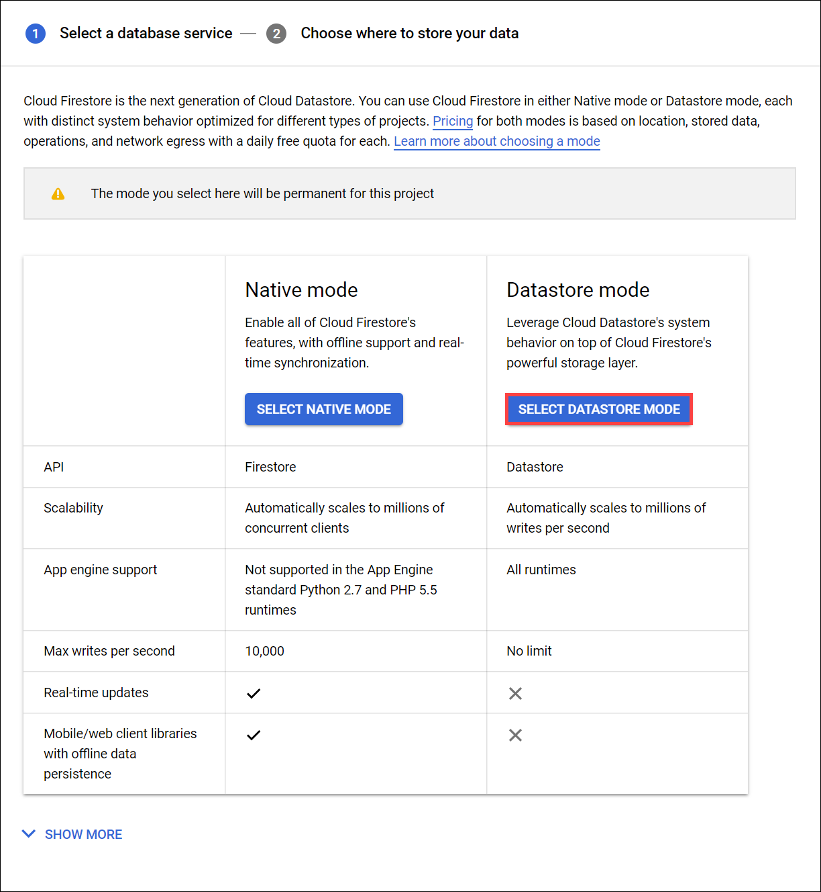
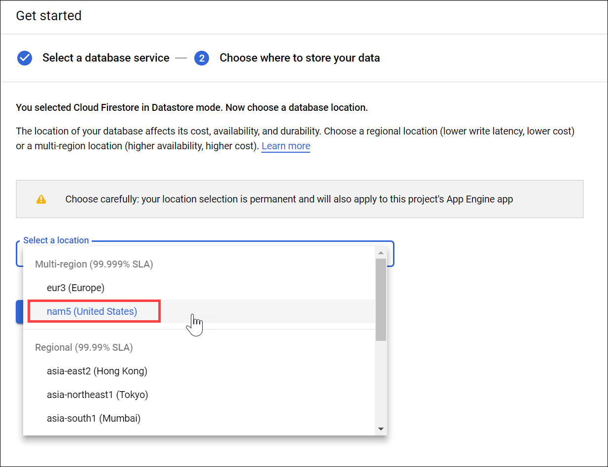
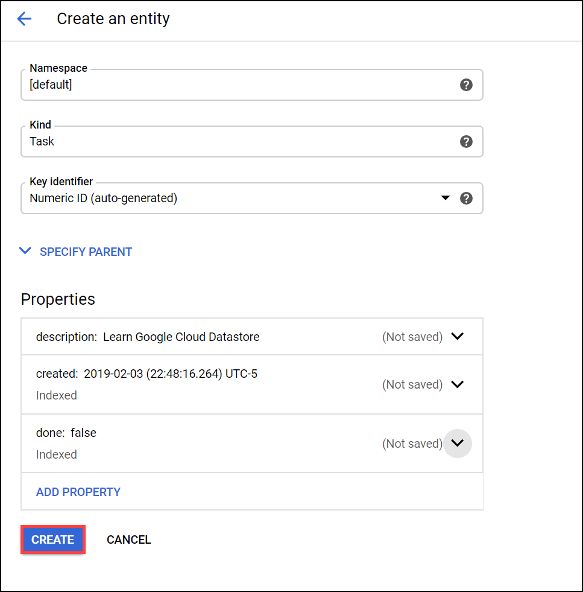
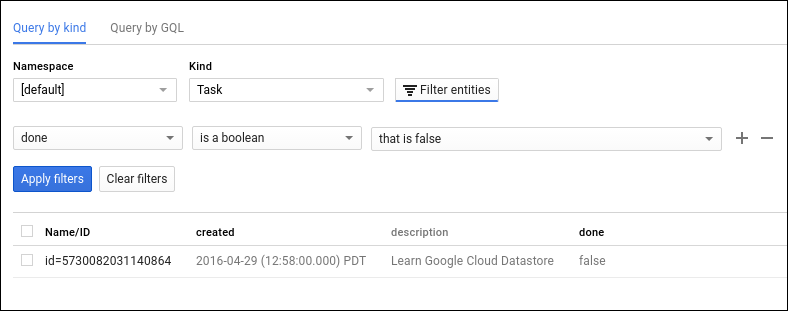
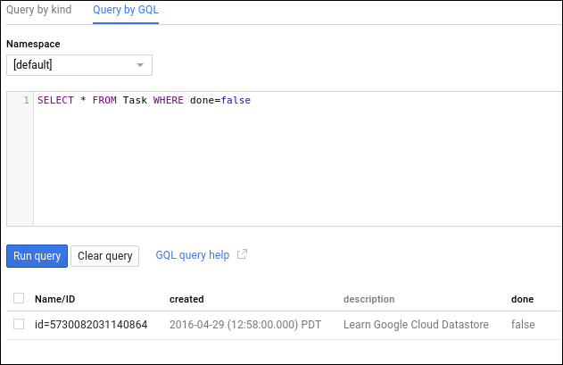

# Datastore: Qwik Start

## Overview
This hands-on lab will show you how to store and query data in Google Cloud Datastore using the Google Cloud.

## LAB STEPS

### Store data
In left menu on the Console, Storage section, go to Datastore > Entities.

Under the Datastore mode column, click Select Datastore Mode.

Now choose where you'll create your database. Use the dropdown menu to select a location:

The location applies to both Cloud Datastore and App Engine for your Google Cloud project. You cannot change the location after it has been saved.

Click Create database.

Click Create Entity.

On the Create an entity page, use [default] for Namespace.

Type Task for Kind.

Under Properties use the Add property button to add these properties, and click Done after each one:

| Name | Type | Value | Indexed |
| ------ | ------ | ------ | ------ |
| description | String | Learn Google Cloud Datastore | ✕ |
| created | Date and time | (today's date) | ✓ |
| done | Boolean | False | ✓ |

Your creation page should now look like this:

Click Create. The console displays the Task entity that you just created.

You just stored data in Cloud Datastore!

## Run a query

Cloud Datastore supports querying data by kind or by Google Query Language (GQL); the instructions below walk you through the steps of doing both.

**Run kind queries**
1. Click Query by kind.
2. Select Task as the kind.

The query results show the Task entity that you created.

Next, add a query filter to restrict the results to entities that meet specific criteria:

1. Click Filter entities tab.

2. In the dropdown lists, select done, is a boolean, and that is false.

3. Click Apply filters. The results show the Task entity that you created, since its done value is false.

4. Now try a query of done, is a boolean, and that is true then Apply filters. The results do not include the Task entity that you created, because its done value is not true.

## Run GQL queries

1. Click the Query by GQL tab.

2. In the query box add the following:
`SELECT * FROM Task`
Note that Task is case sensitive.

3. Click Run query.
The query results show the Task entity that you created.

Now add a query filter to restrict the results to entities that meet specific criteria:

Run this query:
`SELECT * FROM Task WHERE done=false`

Note that Task and done are case sensitive. The results show the Task entity that you created, since its done value is false.

Now run this query:
`SELECT * FROM Task WHERE done=true`
The results do not include the Task entity that you created, because its done value is not true.